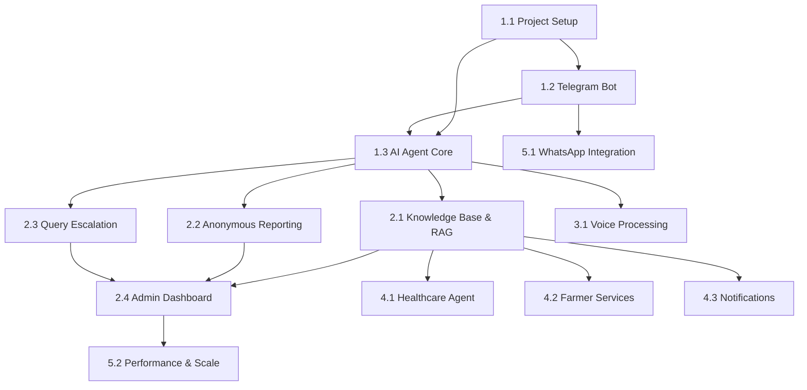

# JanSeva — Master Implementation Guide

> **Read this document first.** It is the map for building the entire JanSeva platform from scratch. Each section references a detailed guide document. Follow the phases in order — each phase builds on the previous one.

---

## Phase 1: Foundation (Iteration 1)

> **Goal**: A working Telegram bot that can receive messages, run them through an AI agent, and respond. No voice, no anonymous reporting — just the skeleton.

### Step 1.1 — Project Scaffolding
📄 **Guide**: [01-project-setup.md](file:///c:/Users/notic/OneDrive/Desktop/Hackathon/GoogleXParul/docs/ai/guides/01-project-setup.md)

What you do:
1. Initialize the Python project with `uv`
2. Create the directory structure (every folder, every `__init__.py`)
3. Set up `pyproject.toml` with all dependencies
4. Create `.env.example` and `.gitignore`
5. Set up Docker Compose for PostgreSQL + Redis
6. Run `alembic init` for database migrations
7. Create the initial database schema (users, conversations, messages tables)
8. Run the first migration to verify everything works
9. **Verify**: `docker compose up` starts PostgreSQL + Redis. `alembic upgrade head` creates the tables.

### Step 1.2 — Telegram Bot (Basic)
📄 **Guide**: [02-telegram-bot.md](file:///c:/Users/notic/OneDrive/Desktop/Hackathon/GoogleXParul/docs/ai/guides/02-telegram-bot.md)

What you do:
1. Create the Telegram bot via BotFather, get the token
2. Build the aiogram bot with router architecture
3. Implement `/start` command (registers user, detects language preference)
4. Implement `/help` command (shows available features)
5. Implement text message handler (echoes for now — will connect to AI later)
6. Add middleware for user session tracking
7. Add rate limiting middleware
8. **Verify**: Send messages to the bot on Telegram, it responds.

### Step 1.3 — AI Agent Core (LangGraph)
📄 **Guide**: [03-ai-agent-core.md](file:///c:/Users/notic/OneDrive/Desktop/Hackathon/GoogleXParul/docs/ai/guides/03-ai-agent-core.md)

What you do:
1. Set up the LangGraph state schema (conversation state)
2. Build the Orchestrator Agent (intent classifier)
3. Build the Service Navigator Agent (answers "what do I need for X?")
4. Connect the LLM (Gemini API or Ollama for local dev)
5. Wire the agents to the Telegram bot (messages flow: Telegram → Agent → Response)
6. Add conversation memory (store/retrieve from PostgreSQL)
7. **Verify**: Ask the bot "What do I need for an income certificate?" and get a coherent answer.

---

## Phase 2: Core Features (Iteration 2)

> **Goal**: Anonymous reporting, form generation, knowledge base (RAG), and query escalation.

### Step 2.1 — Knowledge Base & RAG
📄 **Guide**: [04-knowledge-base-rag.md](file:///c:/Users/notic/OneDrive/Desktop/Hackathon/GoogleXParul/docs/ai/guides/04-knowledge-base-rag.md)

What you do:
1. Create the service catalog data (YAML/JSON files with government service info)
2. Set up ChromaDB (or pgvector) for vector embeddings
3. Build the document ingestion pipeline (load YAML → chunk → embed → store)
4. Integrate RAG into the Service Navigator Agent
5. Build the Form Generator tool (collects user info → generates PDF/text form)
6. **Verify**: Ask specific questions about government services, get accurate answers sourced from the knowledge base.

### Step 2.2 — Anonymous Reporting System
📄 **Guide**: [05-anonymous-reporting.md](file:///c:/Users/notic/OneDrive/Desktop/Hackathon/GoogleXParul/docs/ai/guides/05-anonymous-reporting.md)

What you do:
1. Create the anonymous_reports and authority_hierarchy database tables
2. Build the Anonymous Report Agent (LangGraph subgraph)
3. Implement the metadata stripping pipeline (remove all user-identifiable info)
4. Build the authority routing engine (determine correct superior based on hierarchy)
5. Implement the anonymous report token system (one-time codes for two-way communication)
6. Add encryption at rest for report content
7. **Verify**: Submit an anonymous report via Telegram, verify it cannot be traced to the sender, verify it routes to the correct authority level.

### Step 2.3 — Query Escalation System
📄 **Guide**: [06-query-escalation.md](file:///c:/Users/notic/OneDrive/Desktop/Hackathon/GoogleXParul/docs/ai/guides/06-query-escalation.md)

What you do:
1. Create the escalated_queries table
2. Build the Escalation Agent (detects when the AI can't answer)
3. Implement department classification (route to correct department)
4. Build the admin notification system (new escalation → admin gets notified)
5. Build the response-back pipeline (admin answers → user gets the response)
6. **Verify**: Ask the bot something it can't answer, verify it logs the query and notifies the admin.

### Step 2.4 — Admin Dashboard
📄 **Guide**: [07-admin-dashboard.md](file:///c:/Users/notic/OneDrive/Desktop/Hackathon/GoogleXParul/docs/ai/guides/07-admin-dashboard.md)

What you do:
1. Build the FastAPI admin app (separate from the bot)
2. Implement admin authentication (JWT + bcrypt)
3. Build the escalated queries dashboard (view, assign, respond)
4. Build the anonymous reports dashboard (view status, add notes, mark resolved)
5. Build the analytics overview (total users, queries/day, response times)
6. Build the knowledge base management UI (add/edit/delete service catalog entries)
7. **Verify**: Log into the admin panel, see escalated queries, respond to one, verify the user gets the response on Telegram.

---

## Phase 3: Voice & Language (Iteration 3)

> **Goal**: Users can send voice notes in Hindi or any Indian language and get voice responses.

### Step 3.1 — Voice Processing Pipeline
📄 **Guide**: [08-voice-processing.md](file:///c:/Users/notic/OneDrive/Desktop/Hackathon/GoogleXParul/docs/ai/guides/08-voice-processing.md)

What you do:
1. Set up IndicWhisper model (download from HuggingFace, set up inference)
2. Build the audio preprocessing pipeline (OGG → WAV conversion via pydub/ffmpeg)
3. Build the STT service (voice note → transcribed text + detected language)
4. Set up IndicTTS model
5. Build the TTS service (response text → audio file in user's language)
6. Wire voice into the Telegram handler (voice note → STT → AI Agent → TTS → voice response)
7. Add language preference persistence (remember user's language across sessions)
8. **Verify**: Send a Hindi voice note to the bot, get a Hindi voice response with accurate content.

---

## Phase 4: Extended Services (Iteration 4)

> **Goal**: Healthcare integration, farmer services, notifications.

### Step 4.1 — Healthcare Agent
📄 **Guide**: [09-healthcare-agent.md](file:///c:/Users/notic/OneDrive/Desktop/Hackathon/GoogleXParul/docs/ai/guides/09-healthcare-agent.md)

What you do:
1. Build the Healthcare Agent (LangGraph subgraph)
2. Create the healthcare facility database (hospitals, clinics, specialties, capacity)
3. Implement facility search (find nearby available hospitals)
4. Build the appointment booking flow (collect needs → assign queue number)
5. Add availability checking (real-time status from facility data)
6. **Verify**: Ask "I need an eye checkup", get recommended facility and queue number.

### Step 4.2 — Farmer Services Agent
📄 **Guide**: [10-farmer-services.md](file:///c:/Users/notic/OneDrive/Desktop/Hackathon/GoogleXParul/docs/ai/guides/10-farmer-services.md)

What you do:
1. Build the Farmer Services Agent (LangGraph subgraph)
2. Create the subsidies knowledge base (scheme names, eligibility, application process)
3. Build the subsidy eligibility checker (user profile → matching subsidies)
4. Create wholesale market data (market names, prices, contacts)
5. Build the market price query tool
6. **Verify**: Ask about crop subsidies, get relevant schemes. Ask about wholesale prices, get current data.

### Step 4.3 — Notifications & Profiling
📄 **Guide**: [11-notifications-profiling.md](file:///c:/Users/notic/OneDrive/Desktop/Hackathon/GoogleXParul/docs/ai/guides/11-notifications-profiling.md)

What you do:
1. Build the interest profiling system (track what users ask about)
2. Create the notification engine (new scheme/deadline → find matching users → notify)
3. Implement scheduled notifications (ARQ scheduled jobs)
4. Add user notification preferences (opt-in/out, frequency)
5. **Verify**: Add a new scheme to the knowledge base, verify relevant users get notified.

---

## Phase 5: WhatsApp & Scale (Iteration 5)

> **Goal**: Add WhatsApp as a second channel, optimize for 1000+ users.

### Step 5.1 — WhatsApp Integration
📄 **Guide**: [12-whatsapp-integration.md](file:///c:/Users/notic/OneDrive/Desktop/Hackathon/GoogleXParul/docs/ai/guides/12-whatsapp-integration.md)

What you do:
1. Set up WhatsApp Business API (via Twilio or Meta Cloud API)
2. Build the WhatsApp message handler (webhook-based)
3. Adapt the Channel Normalizer to handle WhatsApp message format
4. Handle WhatsApp-specific media types (voice notes, images, documents)
5. **Verify**: Send messages on WhatsApp, get the same responses as Telegram.

### Step 5.2 — Performance & Scale
📄 **Guide**: [13-scaling-performance.md](file:///c:/Users/notic/OneDrive/Desktop/Hackathon/GoogleXParul/docs/ai/guides/13-scaling-performance.md)

What you do:
1. Add connection pooling for PostgreSQL (asyncpg pool)
2. Implement response caching (Redis) for common queries
3. Add database query optimization (indexes, EXPLAIN ANALYZE)
4. Set up horizontal scaling (multiple bot worker processes)
5. Load test with 100 concurrent users (Locust or k6)
6. **Verify**: System handles 100 concurrent users with <5s response time.

---

## Dependency Order Visualization

---

## How to Use These Guides

Each guide document (`docs/ai/guides/XX-name.md`) follows this format:

1. **What This Does** — Plain-language explanation
2. **Prerequisites** — What must be done before this step
3. **Files to Create/Modify** — Exact file paths and what goes in them
4. **Step-by-Step Instructions** — Numbered, actionable steps with code snippets
5. **Configuration** — Environment variables, settings needed
6. **Verification** — How to confirm this step works
7. **Troubleshooting** — Common issues and fixes

**Important**: Each guide is written so that an AI coding assistant (or a developer) can read it and implement the code without ambiguity. It does not assume prior knowledge of the specific libraries — it tells you what to import, what to call, and what the expected output looks like.
